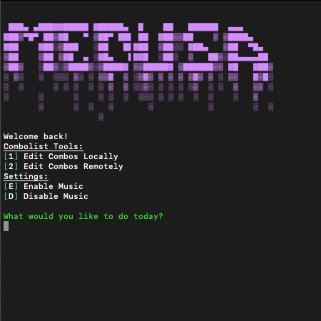
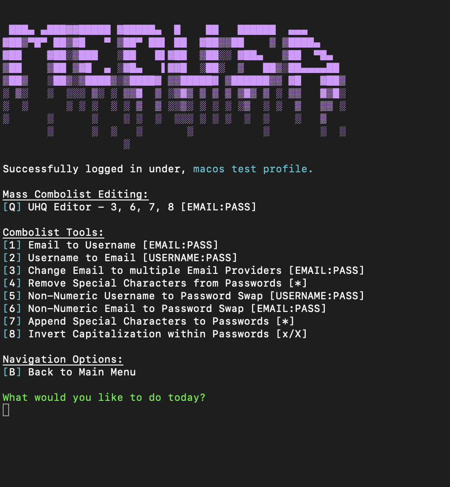

{:height="50%" width="50%"}

## A advanced multi-function combolist editor written in one python file.
*Medusa is a proof-of-concept multi-function advanced combolist editor which has a variety of editing features.*

{:height="50%" width="50%"}

*Medusa is a completely experimental concept. The files pushed to this repository are not distribution ready, although they are still very much usable*

{:height="50%" width="50%"}

## Quick start guide for Medusa Client
Run ```pip3 install -r ./windows/requirements.txt``` or ```pip3 install -r ./macos/requirements.txt```   
then ```python3 medusa.py```
